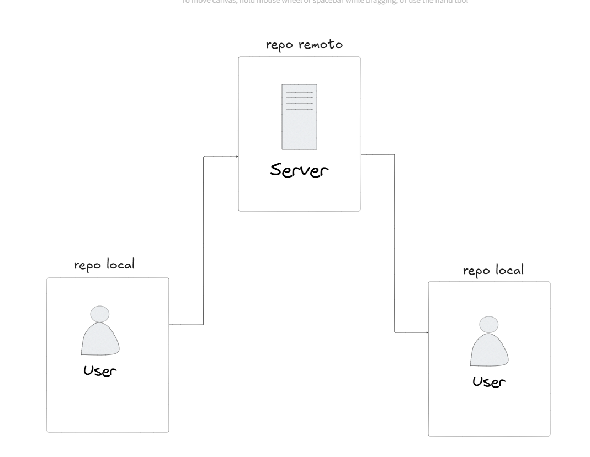
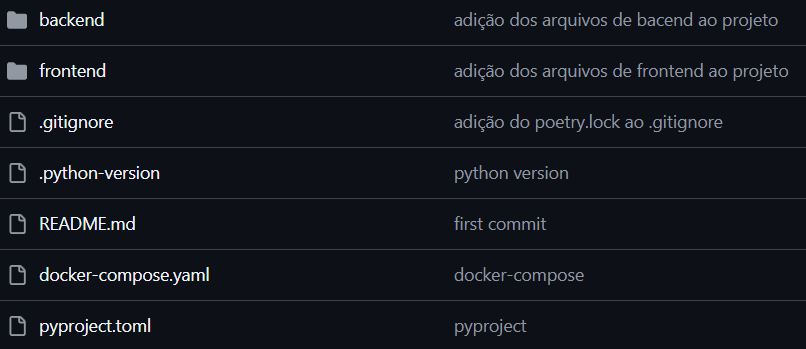

# 📘 Meeting Boas Práticas Ágora

Bem-vindo à documentação do projeto realizado para a reunião de boas práticas de desenvolvimento da Ágora.

Aqui estão descritas algumas etapas e conceitos utilizados na construção do projeto.

---

## 🚀 Let's Get Started

Sem mais delongas, vamos à documentação do projeto!

---

## 🎯 Objetivo

Este projeto tem como objetivo demonstrar boas práticas de desenvolvimento de software aplicadas à engenharia de dados.

Vamos abordar os seguintes tópicos:

- Criação de repositório no GitHub
- Versionamento do runtime Python
- Ambientes virtuais
- Instalação de dependências
- Funções com Docstring e TypeHint
- Programação orientada a objetos (OOP)
- Testes unitários de código
- Integração contínua e entrega contínua (CI/CD)
- Testes de dados

E alguns outros não listados.

---

## 📁 Criação de Repositório

Um repositório é um ambiente para armazenar código. Atualmente, usamos Bitbucket e File System, mas a migração para o GitHub está em andamento.

### ✅ Vantagens do Git/GitHub:

- **Versionamento inteligente**: Rastreabilidade e histórico de mudanças.
- **Branches**: Separação de features e correções sem impactar produção.
- **Colaboração**: Múltiplos desenvolvedores trabalhando simultaneamente.

### 🖼️ Diagrama de funcionamento:



---

## ⚙️ .env e .gitignore

- **`.env`**: Contém variáveis sensíveis (tokens, senhas etc.).
- **`.gitignore`**: Define arquivos e pastas que **não** devem ser versionados.

---

## 🐍 Versão do Python

Definir uma versão específica do Python evita problemas de compatibilidade com bibliotecas. Versões antigas podem não suportar pacotes recentes.

---

## 🧪 Ambiente Virtual

Um ambiente virtual isola bibliotecas do projeto, evitando conflitos entre projetos diferentes.

Analogia: um computador sem ambientes virtuais é como uma casa sem paredes — tudo se mistura!

---

## 🗂️ Estrutura de Diretórios

Organize seu projeto em pastas com **nomes descritivos** e **responsabilidades separadas**.

```text
.
├── app
│   └── ...
├── src
│   └── backend
│       └── ...
```



---

## 📦 Dependências

Instale dependências diretamente no ambiente virtual com ferramentas como:

- [`uv`](https://github.com/astral-sh/uv)
- [`poetry`](https://python-poetry.org/)
- [`pip`](https://pip.pypa.io)

---

## 🧰 Pipelines com OOP

Abordagens possíveis para criação de pipelines:

| Abordagem                | Produtizável | Manutenção |
|-------------------------|--------------|------------|
| Notebook                | ❌           | ❌         |
| Script Procedural       | ✅           | ⚠️         |
| OOP                     | ✅           | ✅         |
| OOP + Testes            | ✅           | ✅💚        |

---

## 🧪 Testes de Código

Testes unitários validam partes isoladas da lógica.

Usamos o `pytest` com a metodologia **AAA**:

1. **Arrange** – preparar dados
2. **Act** – executar ação
3. **Assert** – verificar resultado

---

## 🔁 CI/CD

Pipelines de CI/CD garantem a qualidade do código antes de chegar na produção.

> Se os testes não passarem, o merge na branch `main` será bloqueado.

---

## 🧹 Qualidade de Dados

Para validação de dados, utilizamos o **[Pandera](https://pandera.readthedocs.io/)** — ideal para quem trabalha com dataframes (`pandas`)